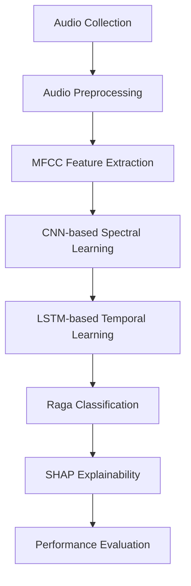

# 🎵 Explainable Spectro-Temporal Modeling for Indian Raga Classification Using Hybrid Neural Network

## 📌 Overview

This project presents an Explainable Artificial Intelligence (XAI) framework for automatic Indian Raga Classification using a Hybrid CNN-LSTM architecture. The proposed system combines spectral feature extraction through Convolutional Neural Networks (CNN), temporal sequence learning through Long Short-Term Memory (LSTM) networks, and model interpretability using SHAP (SHapley Additive Explanations).

Indian Classical Music is built upon intricate melodic structures known as ragas. Accurate identification of ragas requires years of musical expertise due to subtle variations in note patterns, ornamentations, and improvisations. This research aims to automate the raga recognition process while maintaining transparency and interpretability in model predictions.

The proposed framework achieved an overall classification accuracy of **95.56%** across ten Hindustani ragas, demonstrating its effectiveness in computational musicology and intelligent music analysis.

---

## ⭐ Highlights

* Hybrid CNN-LSTM architecture for spectro-temporal feature learning.
* SHAP-powered Explainable AI framework.
* Classification of 10 Hindustani Classical Ragas.
* Achieved **95.56% Accuracy**.
* High interpretability through feature importance analysis.
* Supports preservation of Indian musical heritage through AI.

---

## 🎯 Objectives

* Develop an accurate and automated raga classification system.
* Capture both spectral and temporal characteristics of music.
* Improve model transparency using Explainable AI techniques.
* Assist music education, research, and digital archiving.
* Preserve Indian Classical Music through intelligent computational methods.

---

## 🚀 Features

* Automatic Indian Raga Recognition.
* Hybrid Deep Learning Architecture.
* MFCC-Based Audio Feature Extraction.
* Explainable Predictions using SHAP.
* Multi-Class Classification Framework.
* High Accuracy and Robust Performance.
* Research-Oriented AI System for Music Intelligence.

---
## 🏗️ Methodology Workflow

---

## 🛠️ Technologies Used

* Python
* TensorFlow
* Keras
* NumPy
* Pandas
* Matplotlib
* SHAP
* Deep Learning
* Explainable AI (XAI)

---

## 📂 Dataset Details

### Dataset Statistics

* Total Audio Samples: **1130**
* Total Ragas: **10**
* Sampling Rate: **22050 Hz**

### Included Ragas

* Asavari
* Bageshree
* Bhairavi
* Bhoop
* Bhoopali
* Darbari
* Dkanada
* Malkauns
* Sarang
* Yaman

---

## 🎧 Audio Preprocessing

The following preprocessing techniques were applied:

* Audio Resampling (22050 Hz)
* Silence Removal
* Noise Reduction
* Audio Length Standardization
* Signal Normalization

These preprocessing steps improve feature consistency and model performance.

---

## 🎼 Feature Extraction

### Mel-Frequency Cepstral Coefficients (MFCC)

The MFCC representation was used to capture spectral information from audio signals.

#### Configuration

* Number of MFCC Features: 40
* Time Frames: 216
* Input Shape: (216 × 40 × 1)

MFCC features effectively represent pitch, timbre, and acoustic properties of Indian Classical Music.

---

## 🧠 Model Architecture

### CNN Layer

* 64 Convolution Filters
* Kernel Size: 3×3
* ReLU Activation
* Spectral Feature Extraction

### Max Pooling Layer

* Pool Size: 2×2
* Dimensionality Reduction

### Dropout Layer

* Dropout Rate: 0.3
* Overfitting Prevention

### LSTM Layer

* 64 Memory Units
* Temporal Dependency Learning

### Dense Layer

* 64 Neurons
* ReLU Activation

### Output Layer

* Softmax Activation
* Classification of 10 Raga Classes

---

## ⚙️ Training Configuration

| Parameter               | Value   |
| ----------------------- | ------- |
| Optimizer               | Adam    |
| Learning Rate           | 0.001   |
| Batch Size              | 8       |
| Epochs                  | 100     |
| Early Stopping          | Enabled |
| Learning Rate Scheduler | Enabled |

---

## 📊 Results

### Overall Performance

| Metric    | Value  |
| --------- | ------ |
| Accuracy  | 95.56% |
| Precision | 95.41% |
| Recall    | 95.56% |
| F1 Score  | 95.47% |

---

## 🏆 Best Performing Ragas

| Raga     | Accuracy |
| -------- | -------- |
| Malkauns | 97.97%   |
| Darbari  | 96.80%   |
| Bhairavi | 96.04%   |

### Lowest Performing Raga

* Bageshree: 91.52%

### ROC-AUC Analysis

* Nearly 1.00 across all classes.
* Excellent discrimination capability.

---

## 🔍 Explainable AI (SHAP) Analysis

SHAP was used to interpret and explain model predictions.

### Most Influential Features

* MFCC-39
* MFCC-32
* MFCC-28

### Benefits

* Explains model decisions.
* Identifies influential musical characteristics.
* Improves trust and transparency.
* Supports musicological analysis.

---

## 📊 Comparative Analysis

| Model             | Accuracy   |
| ----------------- | ---------- |
| KNN + Naive Bayes | 80.10%     |
| MFCC + GMM        | 83.70%     |
| SVM               | 86.40%     |
| RNN-LSTM          | 88.60%     |
| CNN               | 91.56%     |
| CNN-LSTM + SHAP   | **95.56%** |

---

## 🧪 Ablation Study

| Configuration            | Accuracy   |
| ------------------------ | ---------- |
| Without LSTM             | 81.62%     |
| Only 13 MFCC Features    | 83.75%     |
| Without CNN              | 84.71%     |
| Without Silence Trimming | 85.42%     |
| Without Dropout          | 86.32%     |
| Without Max Pooling      | 88.05%     |
| Without Early Stopping   | 90.14%     |
| Full Model               | **95.56%** |

---

## 🔬 Key Findings

* CNN effectively captures spectral characteristics.
* LSTM successfully learns temporal dependencies.
* MFCC features provide rich acoustic representation.
* SHAP enhances transparency and interpretability.
* Hybrid CNN-LSTM architecture outperforms traditional approaches.

---

## 🌟 Advantages

* High Classification Accuracy
* Explainable Predictions
* Strong Spectral-Temporal Learning
* Useful for Music Education
* Supports Digital Music Archives
* Preserves Indian Musical Heritage

---

## 🌍 Applications

* Intelligent Music Learning Systems
* Automatic Raga Recognition
* Digital Music Archives
* Music Recommendation Systems
* Computational Musicology Research
* Music Education Platforms
* AI-Based Cultural Heritage Preservation

---

## 📈 Research Contribution

This study contributes to the field of Music Information Retrieval (MIR) and Explainable AI by:

* Developing a hybrid CNN-LSTM framework for Indian Raga Classification.
* Integrating SHAP for explainable predictions.
* Establishing benchmark performance on Hindustani raga datasets.
* Supporting the digital preservation of Indian Classical Music.
* Bridging the gap between AI and musicology research.

---

## 🔮 Future Scope

* Integration of Chroma Features and Spectral Contrast.
* Inclusion of additional ragas and gharanas.
* Attention-Based Deep Learning Architectures.
* Real-Time Raga Recognition Systems.
* Live Concert Analysis and Feedback.
* Mobile Application Development.
* Multimodal Learning (Audio + Lyrics + Notation).
* Advanced Explainable AI Techniques.

---

## 📝 Conclusion

The proposed Explainable Spectro-Temporal Modeling framework successfully combines CNN, LSTM, and SHAP to achieve highly accurate and interpretable Indian Raga Classification. With an overall accuracy of **95.56%**, the system outperforms conventional machine learning and deep learning approaches while providing meaningful explanations for its predictions. The framework offers significant potential for music education, computational musicology, and the preservation of India's rich musical heritage.

---

## 🌟 One-Line Summary

🎶 **An Explainable CNN-LSTM + SHAP based framework achieving 95.56% accuracy for automatic Indian Raga Classification and intelligent preservation of Indian Classical Music.**
